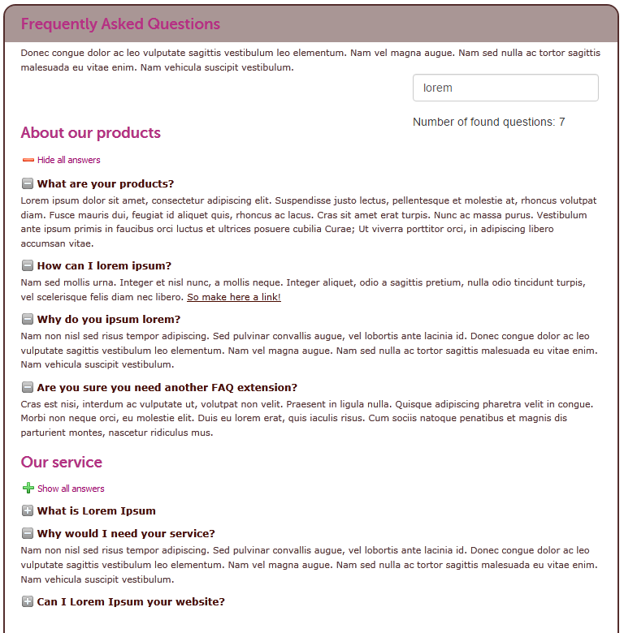
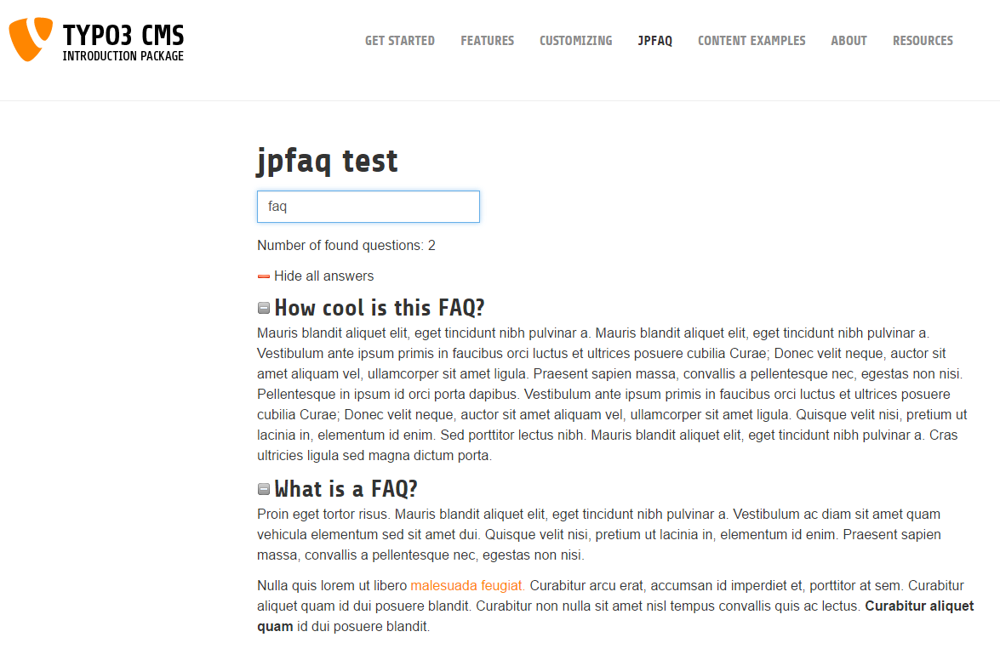

.. ==================================================
.. FOR YOUR INFORMATION
.. --------------------------------------------------
.. -*- coding: utf-8 -*- with BOM.

.. include:: ../Includes.txt

.. _introduction:

Introduction
============

.. _what-it-does:

What does it do?
----------------

Frequently Asked Questions (FAQ) or definitions plugin with rich text answers and / or tt_content IRRE answers. Optional categories and searchform.

.. _screenshots:

Screenshots
-----------

   Example looks jpFAQ, style not included
   
   

   Default looks jpFAQ in Bootstrap Introduction Package
