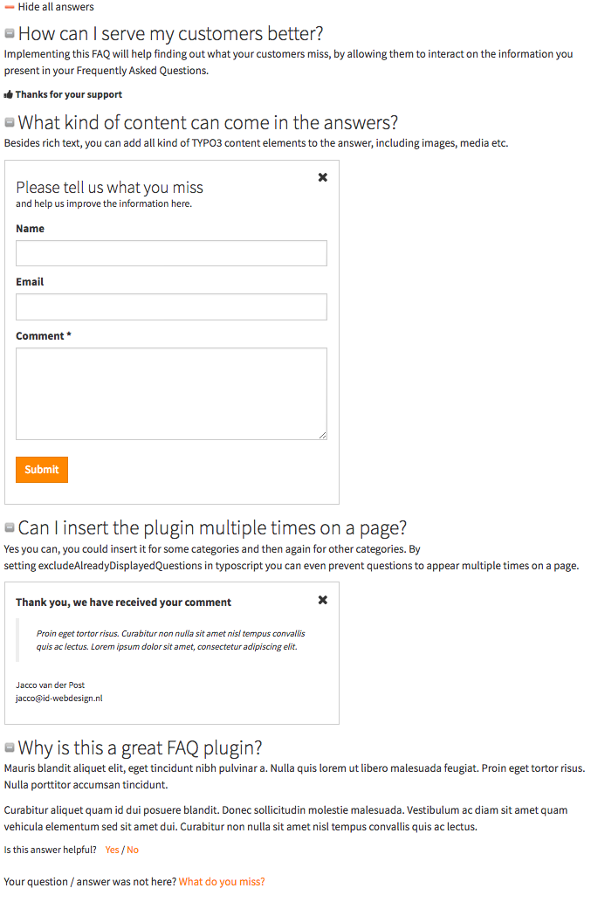

.. ==================================================
.. FOR YOUR INFORMATION
.. --------------------------------------------------
.. -*- coding: utf-8 -*- with BOM.

.. include:: ../Includes.txt

.. _introduction:

Introduction
============

.. _what-it-does:

What does it do?
----------------

Frequently Asked Questions (FAQ) or definitions list with rich text answers and / or tt_content IRRE answers. Optional: categories, helpfulness feedback, inline question and categories Ajax comment forms with database storage and email function, Google Analytics event tracking and a find as you type searchform.

Find out what your customers do find helpful, and what they miss in the information you present in Frequently Asked Questions.

Note that we are working on a premium version with very nice features for corporate implementation, see https://github.com/Zillion01/jpfaq/issues/64

.. _license:

License and contribution
------------------------

This extension is published with the GNU General Public License. So you are allowed to use this plugin for free.

However, building, testing and maintaining this extension costs a lot of unpaid time and effort. That's why a contribution is requested.

Small organization  : €100
Medium organization : €250 - €500
Large organization  : €500 - €1000

This extension allows you to serve your customers better! And besides providing support for maintenance, new futures and new TYPO3 versions compatibility, contributers will get free technical support on bugs.

Please use https://www.paypal.me/JaccoVanderPost or contact jacco@id-webdesign.nl for IBAN and a receipt, thank you.

.. _screenshots:

Screenshots
-----------

.. figure:: ../Images/screenshot.png
   :width: 768px
   :alt: Style not included

      Example looks jpFAQ, style not included

.. figure:: ../Images/screenshot2.png
   :width: 768px
   :alt: Introduction Package

      Default looks jpFAQ in Bootstrap Introduction Package

      Helpfulness interaction and comment forms
